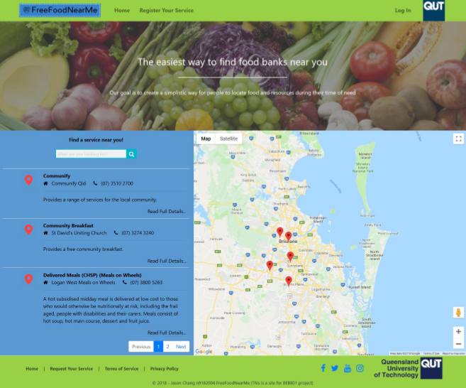
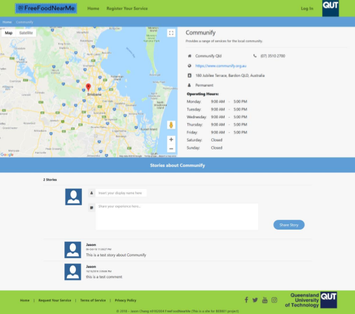
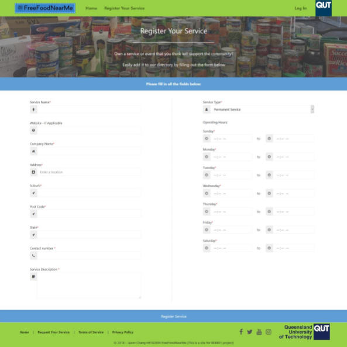

<strong>FreeFoodNearMe</strong>

[Full details here](DetailedReport.pdf)

A project website created to help locate food services for low SES community. 
This website allows users to easily search, locate and contact food services across Brisbane all graphically displayed using Google Maps API. 
Food services are also able to post their services on the website which undergoes a reveiw process before being officially listed.

<strong>Specifications:</strong>
    
    Build:
    ASP.Net MVC - The web framework used
    CosmosDB - Database used
    bootstrap - styling library used
    GoogleAPI - Address autocomplete and map functionality used
    
    Host:
    Hosted on Microsoft Azure (has been removed)
    
<strong>Screenshots:</strong>

Homepage - Main page where services can be searched and located.

Service Details - Information page detailing the service. Allows functionality for users to read and leave "stories"

Register Service - Submission page to allow companies/groups to register their service onto the platform

Authors
    Jason Chang 
